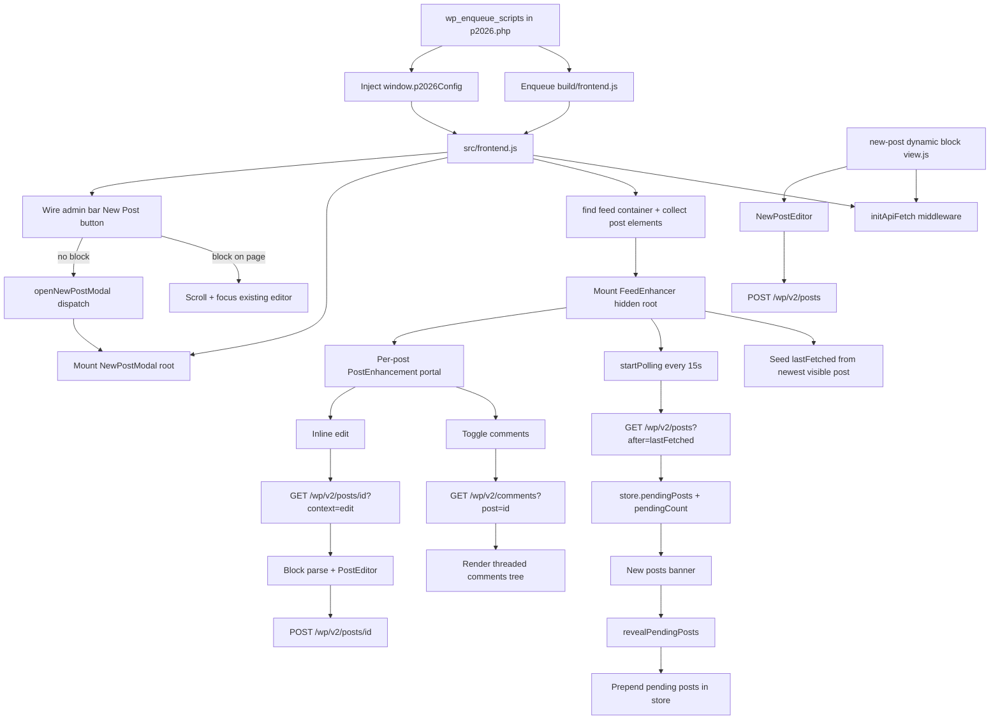

# p2026 Architecture

This plugin adds real-time P2/o2-style collaboration features by progressively enhancing theme-rendered post lists.

## Core Ideas

- Theme HTML remains the source of truth for initial rendering.
- React portals add controls and editors into existing DOM nodes.
- A shared `@wordpress/data` store (`p2026`) drives posts/comments/editor UI state.
- REST API requests are authenticated with nonce + root URL from `window.p2026Config`.

## Runtime Request/Data Flow

## File-Level Responsibilities

- `p2026.php`: block registration, frontend enqueue, config injection, auto-title filter, admin bar node.
- `src/frontend.js`: enhancement bootstrap, portal mounting, modal root, admin bar button wiring.
- `src/store/index.js`: post/comment/polling/editor/modal state and async actions.
- `src/api/index.js`: `apiFetch` middleware and polling utility.
- `src/components/FeedEnhancer.js`: polling orchestration and banner handling.
- `src/components/PostEnhancement.js`: comments/edit controls per post.
- `src/components/Comments.js` + `src/components/Comment.js`: threaded comment UI and replies.
- `src/components/PostEditor.js`: inline edit existing posts with block editor.
- `src/blocks/new-post/view.js` + `src/components/NewPostEditor.js`: frontend new post editor (also used inside modal).
- `src/components/NewPostModal.js`: modal wrapper for new-post editor; driven by `newPostModalOpen` store state.
- `src/blocks/new-post/render.php`: mount point output gated by `publish_posts`.

## Integration Boundaries

- Depends on WordPress REST endpoints under `/wp/v2`.
- Depends on existing theme loop markup for post discovery.
- Build output in `build/` is generated via `@wordpress/scripts` and block manifest support.
