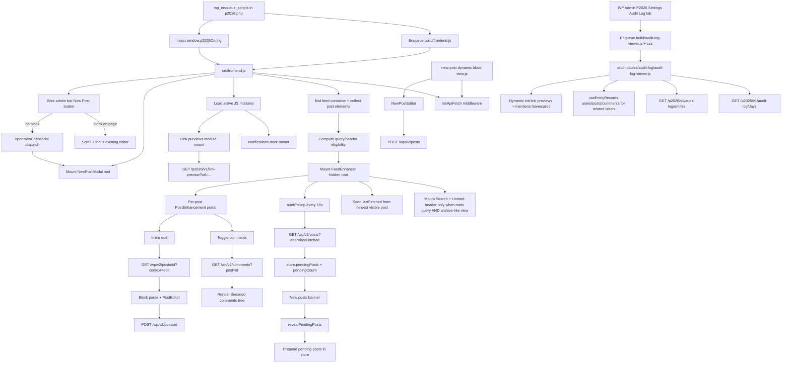

# p2026 Architecture

This plugin adds real-time P2/o2-style collaboration features by progressively enhancing theme-rendered post lists.

This document reflects the 0.3.0 release line.

## Core Ideas

-   Theme HTML remains the source of truth for initial rendering.
-   React portals add controls and editors into existing DOM nodes.
-   A shared `@wordpress/data` store (`p2026`) drives posts/comments/editor UI state.
-   REST API requests are authenticated with nonce + root URL from `window.p2026Config`.
-   JS modules are loaded from `window.p2026Config.activeModules`.

## Runtime Request/Data Flow

## File-Level Responsibilities

-   `p2026.php`: block registration, frontend enqueue, config injection, auto-title filter, admin bar node.
-   `src/frontend.js`: enhancement bootstrap, archive/main-query header gating, modal root, admin bar button wiring.
-   `src/store/index.js`: post/comment/polling/editor/modal state and async actions.
-   `src/api/index.js`: `apiFetch` middleware and polling utility.
-   `src/components/FeedEnhancer.js`: polling orchestration, banner handling, and conditional search/unread header portal.
-   `src/components/SearchWidget.js`: debounced unified post/comment search modal with request-staleness protection.
-   `src/components/UnreadBadge.js`: read-state display and sync trigger.
-   `src/components/PostEnhancement.js`: comments/edit controls per post.
-   `src/components/Comments.js` + `src/components/Comment.js`: threaded comment UI and replies.
-   `src/components/PostEditor.js`: inline edit existing posts with block editor.
-   `src/blocks/new-post/view.js` + `src/components/NewPostEditor.js`: frontend new post editor (also used inside modal).
-   `src/components/NewPostModal.js`: modal wrapper for new-post editor; driven by `newPostModalOpen` store state.
-   `src/blocks/new-post/render.php`: mount point output gated by `publish_posts`.
-   `src/modules/index.js`: loads active JS modules from `window.p2026Config.activeModules`.
-   `includes/github-updates.php`: integrates the plugin `Update URI` with GitHub releases, prereleases, and trunk builds.
-   `modules/link-previews/index.php`: internal link preview REST endpoint and transient caching.
-   `src/modules/link-previews/`: internal-link hover/focus preview card UI.
-   `admin/settings.php`: admin UI for module toggles and audit backend selection.
-   `modules/post-state/index.php`: taxonomy-backed post state, REST field, and state mutation endpoint.
-   `modules/audit-log/index.php`: audit event persistence handler (uploads JSONL or internal CPT), audit settings tab, and admin REST endpoints.
-   `src/modules/audit-log/audit-log-viewer.js`: audit entries browser in WP Admin using DataViews and entity lookups.
-   `src/modules/notifications/`: notification dock UI mounted into `document.body`.

## Module Activation

-   Modules are discovered by scanning `modules/*/index.php`.
-   Activation uses an opt-out deny-list option: `p2026_disabled_modules`.
-   `window.p2026Config.activeModules` is derived server-side as discovered modules minus disabled modules.
-   New modules default to active unless explicitly disabled.

## Integration Boundaries

-   Depends on WordPress REST endpoints under `/wp/v2`.
-   Uses plugin REST endpoints under `/p2026/v1` for search, read-state, and optional modules.
-   Depends on existing theme loop markup for post discovery.
-   Header search/unread widgets are gated by main-query detection plus `window.p2026Config.isArchiveView`.
-   Build output in `build/` is generated via `@wordpress/scripts` and block manifest support.

Plugin REST endpoints currently include:

-   `/p2026/v1/search`
-   `/p2026/v1/read-state`
-   `/p2026/v1/read-state/sync`
-   `/p2026/v1/users`
-   `/p2026/v1/users/{id}`
-   `/p2026/v1/link-preview`
-   `/p2026/v1/notifications`
-   `/p2026/v1/notifications/{id}/read`
-   `/p2026/v1/notifications/read-all`
-   `/p2026/v1/posts/{id}/state`
-   `/p2026/v1/audit-log/days`
-   `/p2026/v1/audit-log/entries`

## Search Behavior Note

-   `GET /p2026/v1/search` is currently logged-in only.
-   Current SQL filters scope results to content authored by the current user.
